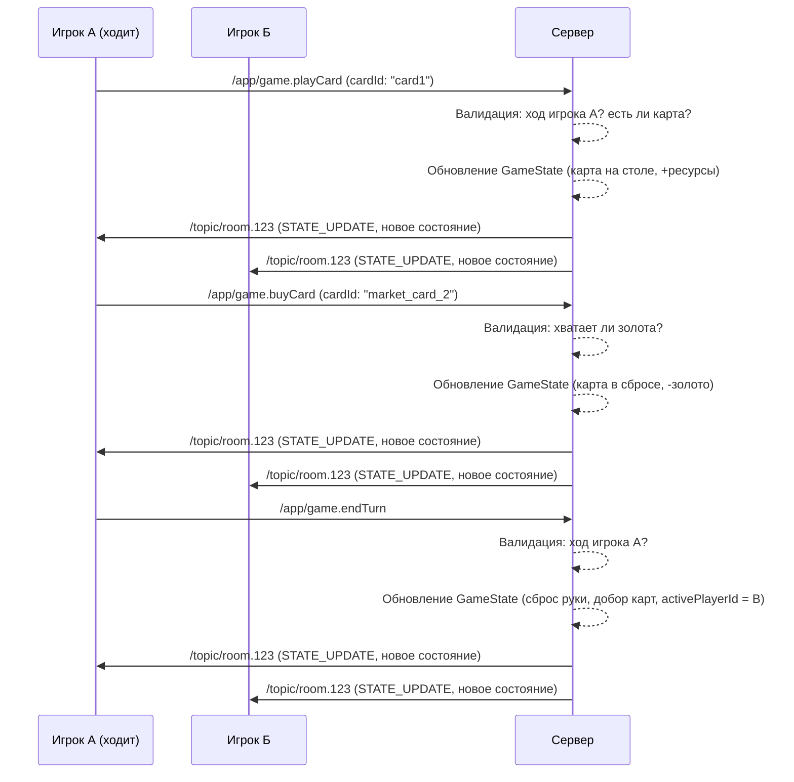

# Архитектура Игры "Cardtopia"

Этот документ описывает архитектуру многопользовательской карточной игры.

## 1. Серверная модель состояния (Game State)

Сервер хранит состояние для каждой активной игровой комнаты. `GameState` — это "снимок" игры в любой момент времени.

```typescript
// Определения базовых типов 1
interface Card {
  id: string;       // Уникальный ID карты, например, "star_realms_scout_1"
  type: string;     // Тип карты, например, "Scout", "Viper"
  cost: number;     // Стоимость покупки
  attack: number;   // Сила атаки
  gold: number;     // Сколько золота дает карта
  ability?: string; // Описание способности (например, "Draw a card")
}

interface Player {
  id: string;                // ID игрока (совпадает с userId)
  name: string;              // Имя игрока
  health: number;            // Здоровье (начинается с 50)
  deck: Card[];              // Карты в колоде игрока (скрыты от оппонента)
  hand: Card[];              // Карты в руке (скрыты от оппонента)
  discardPile: Card[];       // Стопка сброса
  playedCards: Card[];       // Карты, сыгранные в текущем ходу
  
  // Ресурсы текущего хода
  currentAttack: number;     // Суммарная атака в этом ходу
  currentGold: number;       // Суммарное золото в этом ходу
}

// Основной объект состояния игры
interface GameState {
  roomId: string;
  gameStatus: 'WAITING_FOR_PLAYER' | 'IN_PROGRESS' | 'FINISHED';
  players: Player[];
  activePlayerId: string;   // ID игрока, чей сейчас ход
  market: Card[];           // 5 карт, доступных для покупки
  marketDeck: Card[];       // Все остальные карты рынка, из которых пополняется `market`
  winnerId?: string;        // ID победителя, если игра окончена
}
```

### Пояснения к модели:

*   **`Card`**: Я расширил модель карты, добавив `cost`, `gold` и `ability`. Это позволит реализовать всю вашу логику. `id` должен быть уникальным для каждой *конкретной* карты в игре, а `type` — для *типа* карты.
*   **`Player`**:
    *   Содержит все "зоны" карт игрока: `deck`, `hand`, `discardPile`, `playedCards`.
    *   `currentAttack` и `currentGold` — это ресурсы, которые игрок накопил за текущий ход, сыграв карты. Это важно, так как они обнуляются в конце хода.
*   **`GameState`**:
    *   `gameStatus` отслеживает состояние игры (ожидание, активна, завершена).
    *   `activePlayerId` — ключевое поле, определяющее, кто может совершать действия.
    *   `market` и `marketDeck` разделены для удобства.

### Важный момент для Frontend:

Клиент будет получать **адаптированную** версию `GameState`. Например, вы не должны видеть карты в руке или колоде оппонента. Сервер должен будет отправлять каждому игроку только ту информацию, которую ему положено видеть.

---

Что вы думаете об этой структуре? Она покрывает все ваши требования? Может, что-то упустил или стоит добавить?
## 2. WebSocket API (STOMP)

Общение между клиентом и сервером происходит по протоколу STOMP.

### 2.1. Сообщения от Клиента к Серверу (Client -> Server)

Клиент отправляет сообщения на адреса, начинающиеся с `/app`.

| Действие (Action) | Адрес (Destination) | Тело (Body) | Описание |
| :--- | :--- | :--- | :--- |
| **Создать комнату** | `/app/room.create` | `{}` | Игрок просит сервер создать новую игровую комнату. |
| **Присоединиться** | `/app/room.join` | `{ "roomId": "..." }` | Игрок присоединяется к существующей комнате. |
| **Сыграть карту** | `/app/game.playCard` | `{ "cardId": "..." }` | Игрок играет карту из руки. |
| **Купить карту** | `/app/game.buyCard` | `{ "cardId": "..." }` | Игрок покупает карту с рынка. |
| **Атаковать** | `/app/game.attack` | `{}` | Игрок использует накопленную атаку для удара по оппоненту. |
| **Завершить ход** | `/app/game.endTurn` | `{}` | Игрок завершает свой ход. |

### 2.2. Сообщения от Сервера к Клиенту (Server -> Client)

Сервер отправляет сообщения в "топики". Клиенты подписываются на них, чтобы получать обновления.

| Тип сообщения | Топик (Topic) | Тело (Body) | Описание |
| :--- | :--- | :--- | :--- |
| **Обновление состояния** | `/topic/room.{roomId}` | `{ "type": "STATE_UPDATE", "payload": GameState }` | Сервер присылает полное (или адаптированное) состояние игры. |
| **Ошибка** | `/topic/room.{roomId}` | `{ "type": "ERROR", "payload": { "message": "..." } }` | Сервер сообщает об ошибке (не твой ход, нельзя сыграть карту и т.д.). |
| **Игра завершена** | `/topic/room.{roomId}` | `{ "type": "GAME_OVER", "payload": { "winnerId": "..." } }` | Сервер объявляет о завершении игры и победителе. |

### Диаграмма взаимодействия

Вот как выглядит типичный игровой ход:



---

Как вам такой API? Он кажется вам логичным и полным? Возможно, я упустил какие-то важные действия?
## 3. Рефакторинг Frontend

Цель рефакторинга — полностью убрать игровую логику с клиента. Компоненты должны стать "глупыми" и управляться состоянием из Redux.

### 3.1. `gameSlice.ts`
Этот слайс будет хранить `GameState`, полученный от сервера. Никакой логики, кроме как записать новое состояние, здесь быть не должно.

```typescript
// frontend/src/redux/gameSlice/gameSlice.ts

// ... (импорты и определения типов GameState, Player, Card)

const initialState: GameState = { /* ... */ };

// Action creators для middleware
export const connect = createAction<{ roomId: string; token: string }>('game/connect');
export const disconnect = createAction('game/disconnect');
export const sendGameAction = createAction<{ action: string; payload: any }>('game/sendAction');

const gameSlice = createSlice({
  name: 'game',
  initialState,
  reducers: {
    // Единственный редьюсер, который просто заменяет состояние на то, что прислал сервер
    setGameState: (state, action: PayloadAction<GameState>) => {
      return action.payload;
    },
  },
});

export const { setGameState } = gameSlice.actions;
export default gameSlice.reducer;
```

### 3.2. Компоненты (Пример: `Hand.tsx`)

Компоненты будут только читать данные из `useSelector` и отправлять действия с помощью `useDispatch`.

**Было (неправильно):**
```typescript
// Логика была прямо в компоненте
const playCard = (card) => {
  // ... какая-то логика на клиенте
  setHand(hand.filter(c => c.id !== card.id)); // ОПАСНО!
}
```

**Станет (правильно):**
```typescript
// frontend/src/shared/ui/Hand/Hand.tsx

import { useSelector, useDispatch } from 'react-redux';
import { sendGameAction } from 'redux/gameSlice/gameSlice';
import { RootState } from 'redux/store';

export const Hand = () => {
  const dispatch = useDispatch();
  const hand = useSelector((state: RootState) => state.game.players.find(p => p.id === state.game.activePlayerId)?.hand);
  const isMyTurn = useSelector((state: RootState) => state.game.activePlayerId === state.auth.userId);

  const handlePlayCard = (cardId: string) => {
    // Просто отправляем намерение на сервер
    dispatch(sendGameAction({ action: 'game.playCard', payload: { cardId } }));
  };

  if (!hand) return null;

  return (
    <div>
      {hand.map(card => (
        <button 
          key={card.id} 
          onClick={() => handlePlayCard(card.id)}
          disabled={!isMyTurn} // Кнопка неактивна, если не наш ход
        >
          {card.name}
        </button>
      ))}
    </div>
  );
};
```
### 3.3. `stompMiddleware.ts`
Эта middleware будет слушать `sendGameAction` и отправлять соответствующее сообщение на сервер через STOMP.

---

Этот подход гарантирует, что клиент не сможет нарушить правила игры, а весь интерфейс будет реактивно обновляться в ответ на сообщения от сервера. Согласны с таким планом рефакторинга?
## 4. Задачи для Backend (Java/Spring)

На сервере должна быть реализована вся игровая логика.

### 4.1. Управление комнатами и состоянием
- **`GameService`**: Сервис, который управляет жизненным циклом игровых комнат. Должен содержать `Map<String, GameState>` для хранения состояния всех активных игр.
- **`WebSocketController`**: Контроллер для обработки STOMP-сообщений от клиентов.

### 4.2. Реализация игровых действий (методы в контроллере)

Каждое действие, которое присылает клиент, должно обрабатываться соответствующим методом, помеченным аннотацией `@MessageMapping`.

- **`@MessageMapping("/room.create")`**:
  1. Создает новую игровую комнату с уникальным `roomId`.
  2. Создает `GameState` со статусом `WAITING_FOR_PLAYER`.
  3. Добавляет создателя как первого игрока.
  4. Отправляет `STATE_UPDATE` создателю.

- **`@MessageMapping("/room.join")`**:
  1. Находит комнату по `roomId`.
  2. Проверяет, есть ли место в комнате.
  3. Добавляет второго игрока.
  4. Меняет `gameStatus` на `IN_PROGRESS`.
  5. **Инициализирует игру**:
     - Создает стартовые колоды для обоих игроков (10 карт: 8 с золотом, 2 с атакой).
     - Перемешивает колоды.
     - Выдает каждому игроку по 3 стартовые карты в руку.
     - Формирует и перемешивает `marketDeck`, выкладывает 5 карт в `market`.
     - Случайно выбирает `activePlayerId`.
  6. Рассылает `STATE_UPDATE` обоим игрокам.

- **`@MessageMapping("/game.playCard")`**:
  1. **Валидация**: Проверить, что сообщение прислал `activePlayerId`, и что у него в руке есть карта с таким `cardId`.
  2. **Логика**:
     - Переместить карту из `hand` в `playedCards`.
     - Прибавить `card.attack` к `player.currentAttack` и `card.gold` к `player.currentGold`.
     - *Обработать особые способности карты, если они есть (например, "взять карту").*
  3. Разослать `STATE_UPDATE` обоим игрокам.

- **`@MessageMapping("/game.buyCard")`**:
  1. **Валидация**: Проверить, что это ход `activePlayerId`, и что у него достаточно `currentGold` для покупки.
  2. **Логика**:
     - Вычесть `card.cost` из `player.currentGold`.
     - Переместить купленную карту в `player.discardPile`.
     - Взять новую карту из `marketDeck` и положить ее на место купленной в `market`.
  3. Разослать `STATE_UPDATE` обоим игрокам.

- **`@MessageMapping("/game.attack")`**:
    1. **Валидация**: Проверить, что это ход `activePlayerId`.
    2. **Логика**:
        - Найти оппонента.
        - Вычесть `player.currentAttack` из `opponent.health`.
        - Обнулить `player.currentAttack`.
        - Проверить, не равно ли `opponent.health` нулю. Если да, завершить игру.
    3. Разослать `STATE_UPDATE` обоим игрокам.

- **`@MessageMapping("/game.endTurn")`**:
  1. **Валидация**: Проверить, что это ход `activePlayerId`.
  2. **Логика**:
     - Переместить все карты из `player.hand` и `player.playedCards` в `player.discardPile`.
     - Обнулить `player.currentAttack` и `player.currentGold`.
     - Передать ход другому игроку (изменить `activePlayerId`).
     - **Выдать новому активному игроку 5 карт**:
       - Взять 5 карт из его `deck`.
       - Если в `deck` не хватает карт, перемешать `discardPile` и сделать его новым `deck`. Затем добрать недостающие карты.
  3. Разослать `STATE_UPDATE` обоим игрокам.

### 4.3. Безопасность
- **Аутентификация**: WebSocket-соединение должно быть защищено. Spring Security позволяет проверять JWT-токен при установке соединения.
- **Авторизация**: Каждый метод контроллера должен проверять, имеет ли право игрок, приславший сообщение, совершать это действие (например, является ли он `activePlayerId`).

---

Этот план дает четкое представление о том, какая работа должна быть проделана на бэкенде.